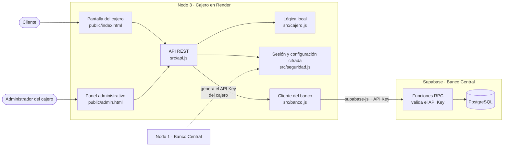
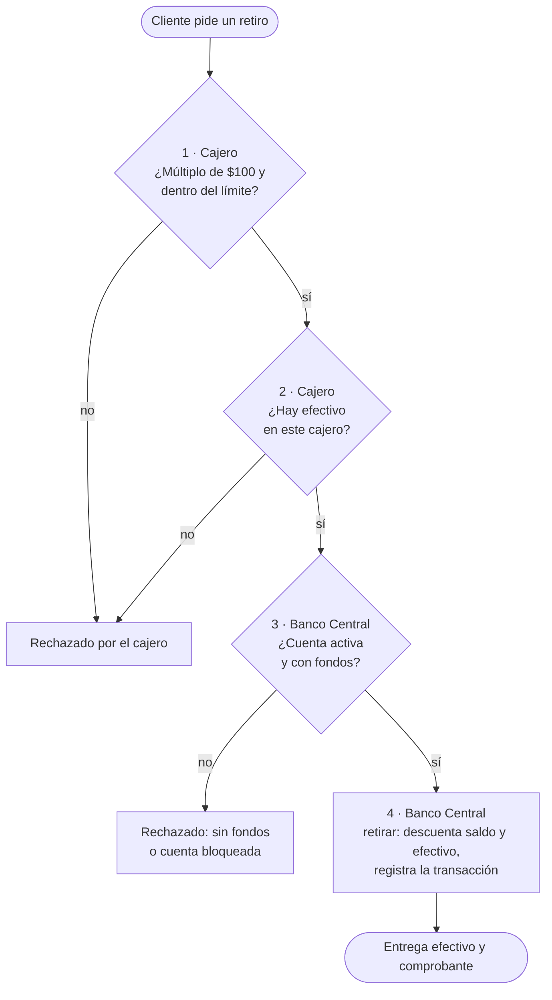

# Nodo 3 · Servidor de cajero automático (ATM)

Backend ligero y pantalla del cajero del **Sistema Bancario Distribuido**
(Examen 2 Práctico): consulta de saldo, retiros y depósitos, con su panel de configuración.

## Enlaces

| Nodo | Aplicación desplegada | Tecnología |
|---|---|---|
| 1 · Banco Central | https://examen2-tawd-nodo1.onrender.com | Laravel + Supabase |
| 2 · Sucursal | https://examen2-tawd-nodo2.onrender.com | Express |
| **3 · Cajero automático** | https://examen2-tawd-nodo3.onrender.com | Express |
| Panel administrativo del cajero | https://examen2-tawd-nodo3.onrender.com/admin | |

La aplicación está en el plan gratuito de Render: si lleva un rato sin uso, la primera
carga tarda cerca de un minuto.

## Arquitectura del nodo

El cajero no tiene base de datos. Aplica primero su lógica local y, si la operación
pasa, la envía al Banco Central (Supabase) identificándose con el API Key del cajero.



| Función | Dónde | Ruta del nodo | Función en el Banco Central |
|---|---|---|---|
| Consultar saldo | Pantalla del cajero | `POST /api/cajero/saldo` | `consultar_saldo` |
| Retirar efectivo | Pantalla del cajero | `POST /api/cajero/retiro` | `nodo_info`, `consultar_saldo`, `retirar` |
| Abonar a una cuenta | Pantalla del cajero | `POST /api/cajero/deposito` | `consultar_saldo`, `depositar` |
| Configurar el API Key y las reglas | Panel `/admin` | `PUT /api/admin/config` | `nodo_info` |
| Ver efectivo y movimientos del cajero | Panel `/admin` | `GET /api/admin/estado` | `nodo_info`, `historial` |

### Lógica local del cajero

Un retiro pasa por cuatro verificaciones. Las dos primeras las hace el cajero por su
cuenta; si alguna falla, no se envía nada al banco.



El comprobante muestra los cuatro pasos y quién verificó cada uno. Las reglas
(denominación, retiro máximo y depósito máximo) se cambian desde el panel.

### Configuración del cajero

1. El administrador del banco crea el cajero en el nodo 1 y obtiene su API Key (`bk_atm_…`).
2. El API Key se define en la variable `BANCO_API_KEY`, o se pega en el panel `/admin`.
3. El panel lo verifica contra el banco, rechaza los que son de sucursal y lo guarda
   cifrado (AES-256-GCM) en una cookie del navegador, que queda como terminal del cajero.

El cliente se identifica con su número de cuenta; el esquema del banco no incluye NIP.

## OpenAPI

[`openapi.yaml`](openapi.yaml) documenta las rutas de este servidor: operaciones del
cajero y panel administrativo, con sus códigos de error.

Para verlo como documentación interactiva, abrir https://editor.swagger.io y pegar el
contenido del archivo.

## Despliegue

Web Service de Node en Render, con despliegue automático en cada `git push` a `main`.

| Paso | Valor |
|---|---|
| Construcción | `npm install` |
| Arranque | `npm start` |

Variables de entorno: `SUPABASE_URL`, `SUPABASE_ANON_KEY`, `BANCO_API_KEY`,
`ATM_ADMIN_USUARIO`, `ATM_ADMIN_PASSWORD`, `SESSION_SECRET`.

El pipeline completo y el flujo entre los tres nodos están explicados en el README del nodo 1.

## Ejecución local

Requiere Node 20 o superior.

```bash
npm install
cp .env.example .env
npm start
```

Abrir http://localhost:3001 (cajero) y http://localhost:3001/admin (panel).